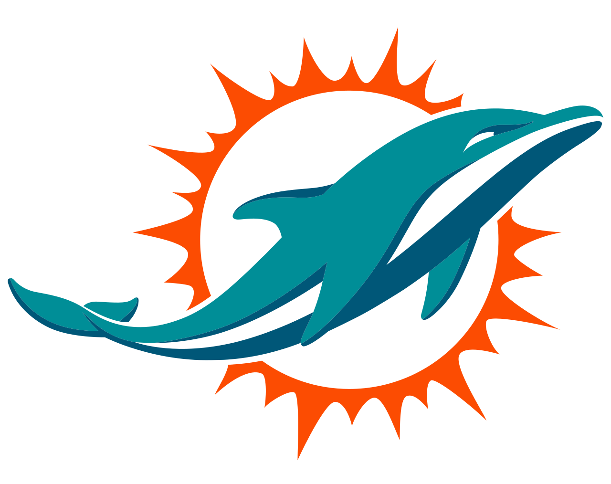
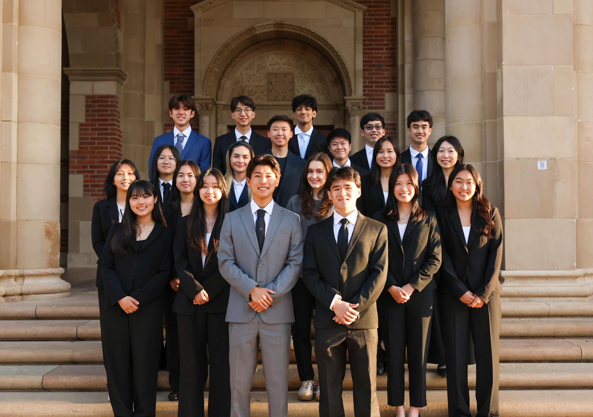

[Download Resume](DW_Resume_Website.pdf){.btn .btn-primary}

My work focuses on building **data-driven tools that transform large and complex datasets into actionable insights**.

I have built analytics tools used by **UCLA Football coaches**, developed **business analytics dashboards for the Miami Dolphins**, and led development of a **full-stack research database** for the Orsulic Lab at UCLA.

---

## Education

::: {.education-card}

### University of California, Los Angeles (UCLA)

**Degrees**  
B.S. Statistics & Data Science  
B.A. Business Economics  

**Expected Graduation**  
June 2026  

**Relevant Coursework**  
Linear Algebra • Multivariable Calculus • Probability • Computation & Optimization • Monte Carlo Methods • Linear Models • Statistical Models & Data Mining • Python with Applications • Economic Forecasting

:::

## Industry Experience

### {width=40} Miami Dolphins — Business Analytics Intern (Summer 2025)

During my internship with the **Miami Dolphins**, I built analytics dashboards and data pipelines used by marketing, operations, and partnerships teams.

My work included:

- analyzing **100k+ scheduling records and conversion metrics**
- building SQL pipelines for **87k+ survey responses**
- delivering analytics insights on F1 Miami Grand Prix event performance

---

### {width=40} Takeda Oncology — Business Intelligence Intern (Summer 2024)

At **Takeda Oncology**, I developed Power BI dashboards analyzing marketing engagement and promotional performance to support strategic decision-making in the German pharmaceutical market.

---

## Leadership

### {width=40} DataRes @ UCLA — Co-President

{fig-align="left" width="400"}

I currently serve as **Co-President of DataRes**, UCLA’s largest student data science organization.

In this role I lead a **20-person board and a community of 200+ members**, organizing hands-on data science experiences across research, consulting, journalism, and education subteams.

My work focuses on:

- spearheading applied student data science projects
- organizing technical workshops and speaker events  
- expanding the data science community at UCLA through fun retreats & socials

---

## Awards

::: {.award-card}
🏆 **UCLA DataFest 2025 — Judge’s Choice Award**

My team received the Judge’s Choice Award at **UCLA DataFest**, an annual **48-hour data science hackathon** where teams analyze large real-world datasets.
:::

## Technical Skills

**Programming Languages**  
Python (pandas, NumPy, scikit-learn, XGBoost, PyTorch, matplotlib)  
R (tidyverse, Shiny)  
SQL (PostgreSQL, MySQL)  
C++
JavaScript

**Data Science & Analytics**
Machine Learning, Statistical Modeling, Data Visualization, Data Pipelines, API Integration, Database Design, Data Platforms, Web Applications

**Tools & Technologies**  
Databricks, Power BI, Tableau, Git, Excel  
React, Django, REST APIs  
AWS (EC2, S3)

---

## Interests

Outside of work, I enjoy:

- basketball  
- running
- bouldering  
- chess
- french horn  
- card games

{fig-align="left" width="400"}