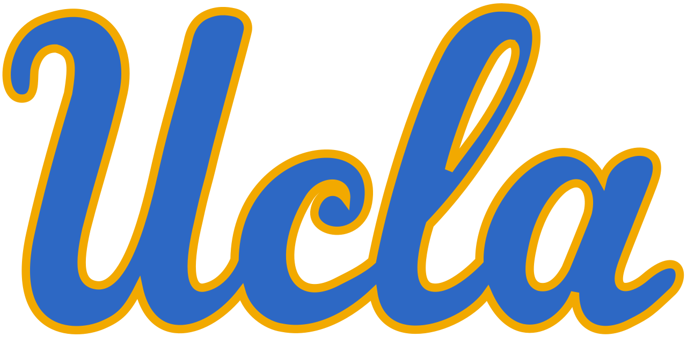
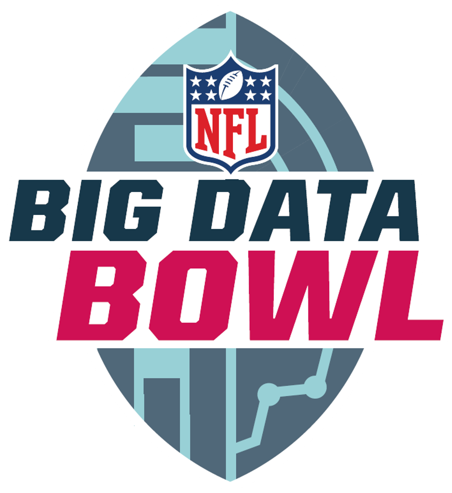

## {width=40} UCLA Football Sports Science Database

Developing an interactive sports science database integrating comprehensive Catapult GPS data and VALD strength metrics to help coaches evaluate player load and performance. The platform allows coaches and performance staff to monitor athlete development, uncover relationships between strength development and on-field performance, and benchmark players across the team.

Key features:

- Custom player athleticism score
- Interactive dashboards for strength and conditioning metrics  
- Athlete benchmarking across positions  
- Development tracking over time  
- Performance correlation analysis  

**Live App:**  
[Open Sports Science Database](https://uclafootball.shinyapps.io/performance_database/)

---

## {width=40} High School Football Scouting Database

Developed an end-to-end data pipeline to scrape and structure high school football recruiting data from 247Sports, overcoming platform limitations that only surface top-ranked prospects. Integrated the data into an interactive RShiny database with dynamic filters to enable efficient prospect tracking and analysis for recruiting workflows.

The only way to access all recorded high school recruits is via the 247 player search tool, which is very inefficient as it requires scrolling through the entire list of recruits. Furthermore, there is no simple way to extract this data. This tool overcomes that problem.

**Live App:**  
[Open High School Football Database](https://dwang22.shinyapps.io/hs_scraper/)

---

## {width=40} UCLA Football Transfer Portal Scouting App

Built an RShiny scouting platform that consolidates advanced analytics on every college football player and ranks transfer portal prospects based on projected on-field contribution and fit with UCLA.

The platform is used by UCLA Football personnel staff to support recruiting and roster management decisions. Available for public use now that the transfer portal window has officially closed.

Key features:

- Transfer portal prospect scoring model  
- Interactive filters
- Prospect comparison tools 

**Live App:**  
[Open Transfer Portal Analytics App](https://dwang22.shinyapps.io/transfer_project/)

---

## {width=40} Orsulic Lab Ovarian Cancer Research Database

Led a 6-person team building a cloud-based research platform that enables scientists to query and visualize correlations across more than **200,000 ovarian cancer features** spanning multiple biological domains.

The platform dramatically reduces the time required to analyze complex datasets by enabling instant correlation queries and interactive visualizations.

Tech stack:

- React  
- Django REST API  
- PostgreSQL  
- AWS  

**Live Platform:**  
[Open Orsulic Lab Database](https://database.orsuliclab.com/)

---

## {width=40} 2026 NFL Big Data Bowl — Defensive Coverage Opportunity Modeling

Collaborated in a team of three to develop a spatial analytics framework for evaluating defensive pass coverage using NFL player tracking data.

The project shifts evaluation from noisy outcomes (interceptions) to measuring **interception opportunity creation**, estimating how defenders influence the probability of an interception based on spatial positioning and movement dynamics.

Key contributions:

- Processing millions of spatiotemporal tracking records  
- Modeling defender–receiver dynamics during pass plays  
- Estimating control over a probabilistic ball landing zone  
- Designing visualizations to communicate coverage impact  

The NFL Big Data Bowl is an annual analytics competition that challenges data scientists to generate new insights using NFL Next Gen Stats tracking data.

**Full Write-Up**  
[Read the Kaggle Submission](https://www.kaggle.com/competitions/nfl-big-data-bowl-2026-analytics/writeups/HQIOs)
